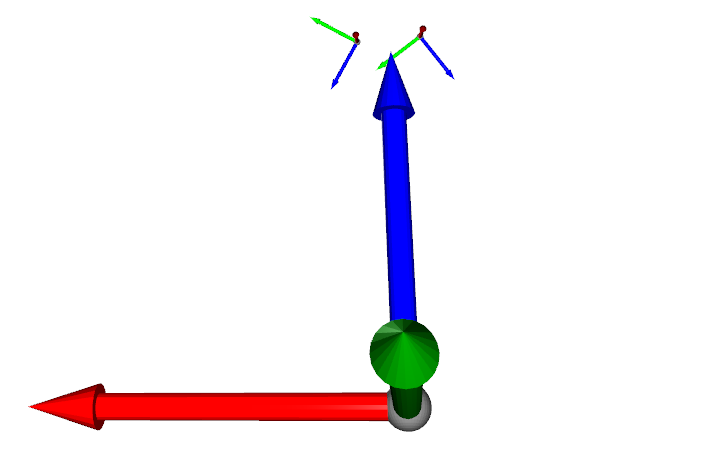
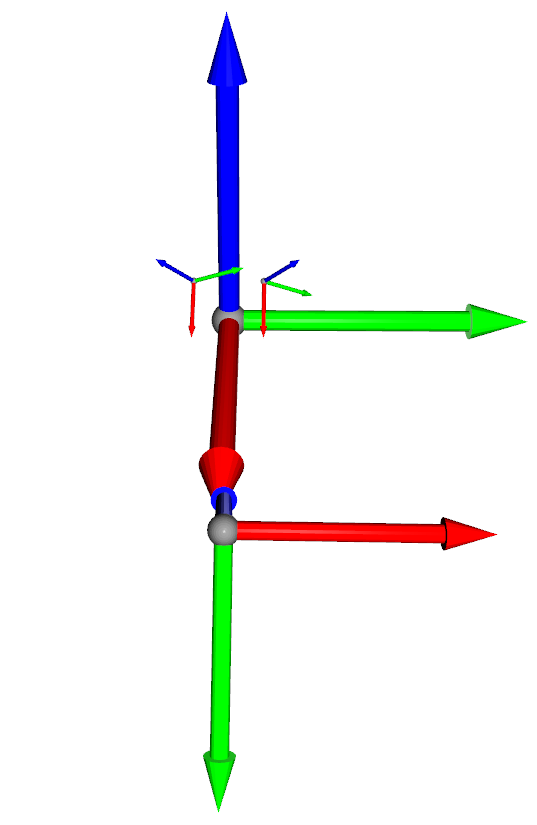

# VR Teleoperation

## Environment Setup
### Hardware Requirements
- Two Flexiv Rizon 4 robot arms.
- Meta Quest 3 VR headset.
- One or multiple cameras (tested on Realsense D435 and D415)
- Host machine with Ubuntu 20.04 or 22.04 (tested on RTX 4090 GPU, driver 535.183.01 and CUDA 12.2.1).

### 1. Install Docker and Build the Docker Image
A ROS2-Humble docker image is used to build the environment.
The environment can also be built on a local machine with Ubuntu 22.04 and ROS2 Humble by manually installing the dependencies.
1. Install [Docker](https://docs.docker.com/engine/install) on the host machine.
2. Install [Nvidia Container Toolkit](https://docs.nvidia.com/datacenter/cloud-native/container-toolkit/latest/install-guide.html#configuring-docker) on the host machine.
3. On the host machine, run the following command to build the docker image:
```bash
make docker.build
```

### 2. [Optional] Install Required Camera SDKs
1. If RealSense cameras are used, install [librealsense2](https://dev.intelrealsense.com/docs/compiling-librealsense-for-linux-ubuntu-guide) on the host machine.

### 3. Calibrate the Cameras
An example calibration result in provide in [data/calibration](data/calibration).
Each `A_to_B_transform.json` contains the transformation from coordinate system A to coordinate system B.
To visualize the calibration result, run the following command:
```
python test/test_calibration.py
```
An example visualization is shown below:
- The robot bases (small) in the external camera's coordinate (large)


- The robot bases (small) and external camera (middle) in the world coordinate (large)


### 4. Build the Unity Project into Quest3
Please refer to the [Unity Build Guidance](Unity/README.md) for building the APP into Quest3.

## Usage
1. Note that the host machine's project directory has been mapped to the docker container's `/root/teleop` directory, so the code can be edited on the host machine and run inside the docker container.

   [Hydra](https://hydra.cc/docs/intro/) is used to manage the configuration files. The [config/task](config/task) directory contains the configuration files for different hardware setups (tasks). The [config/default.yaml](config/default.yaml) file contains which task to use.
   
   - For *permanent changes*, edit the configuration files in the [config](config) directory. For example, edit [config/task/default.yaml](config/task/default.yaml) to configure the host's, VR's, robots' IP addresses and other parameters. Edit [config/task/bimanual_two_realsense_left_10fps.yaml](config/task/bimanual_two_realsense_left_10fps.yaml) to configure the camera's serial number and other parameters.
  
   - For *temporary changes*, the configuration can be overridden by adding extra parameters to the python command in [Makefile](Makefile) as the following example:
      ```bash
      teleop.luanch_robot:
         . ../teleop-env/venv/bin/activate && \
         ${PREPARE_ROS} && \
         python teleop.py \
         task=${TASK} \
         robot_server.port=10000
      ```

   The used hardware setup is assigned in [Makefile:teleop config](Makefile#L7).

   The recording path is set in [Makefile:record config](Makefile#L10).
   > A new hardware setup can be created by adding a new yaml file in the [config/task](config/task) directory. To use custom cameras or custom robots, a publisher need to be implemented in the [publisher](real_world/publisher) directory.
 
   > To enable camera streaming in Quest3, please set `enable_streaming: True` in the task configuration file for each camera. You can set the display pose and scale (world coordinate system in VR) of each camera. 
2. Create the folder for recording data as specified in the [Makefile:record config](Makefile#L10) and run the following command to start the docker container:
    ```bash
    make docker.run
    ```

3. Follow [VR Usage.md](VR%20Usage.md) to run the VR teleoperation software.

   Inside the docker container, use tmux to split the terminal into 3 panes:
   - Pane 1: Run the following command to launch cameras:
      ```bash
      make teleop.launch_camera
      ```
   - Pane 2: Run the following command to start teleoperation:
      ```bash
      make teleop.launch_robot
      ```
   - Pane 3: Run the following command to start recording the teleoperation data:
      ```bash
      make teleop.start_record
      ```
   Change the [Makefile:SAVE_FILE_NAME](Makefile#L13) and run the above commands several times to record multiple trials in [Makefile:SAVE_DIR](Makefile#L12).

4. Inside the docker container, run the following command to process the recorded data.
    ```bash
    make teleop.post_process
    ```

## Troubleshooting
1. If the camera is not detected, try to remove the container by executing `make docker.remove`, replug the camera, and execute `make docker.run` again.
2. If the camera publisher or the robot publisher is not working correctly, you can launch an independent node in [subscriber](real_world/subscriber) to debug each publisher. You can also use the [rqt_graph](https://docs.ros.org/en/humble/Tutorials/Beginner-CLI-Tools/Understanding-ROS2-Topics/Understanding-ROS2-Topics.html#rqt-graph) of ROS2 to visualize the current topics, publishers and subscribers.
 